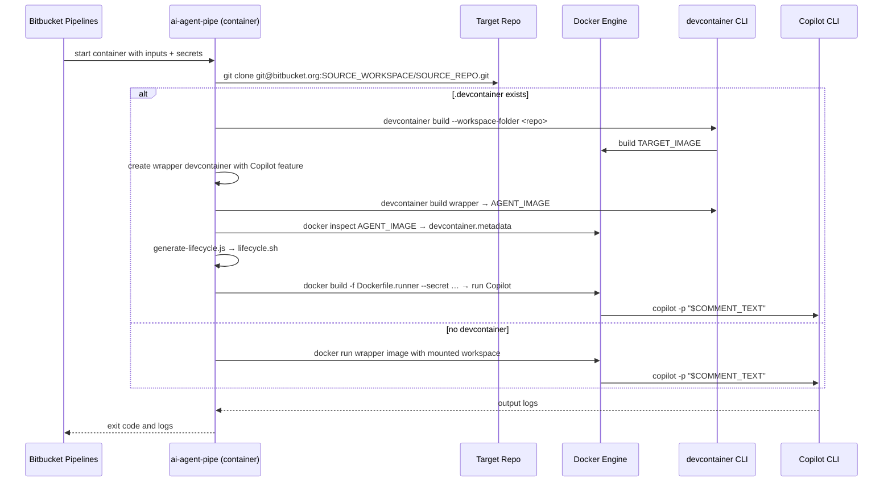

# ai-agent-pipe

A reusable **[Bitbucket Pipe][bb-pipes]** that runs the
[ai-agent-hub](https://github.com/FabianSchurig/ai-agent-hub) workflow –
clone a target repository, build its devcontainer (if any), and execute
the GitHub Copilot CLI as a headless AI agent against it.

It is designed to be invoked by the
[forge-bitbucket-ai-agent-dispatcher](../README.md) Forge app via the
Bitbucket [on-demand pipelines API][bb-ondemand], so teams do not need to
maintain a separate hub repository or `bitbucket-pipelines.yml`.

The pipe image is published to GitHub Container Registry on every push to
`main` and on every GitHub Release – see
[`../.github/workflows/publish-pipe.yml`](../.github/workflows/publish-pipe.yml).

```
ghcr.io/fabianschurig/forge-bitbucket-ai-agent-dispatcher/ai-agent-pipe:<tag>
```

---

## Architecture



### Two-image rationale

| Image | Built when | Contains | Purpose |
|------|------------|----------|---------|
| **A – runtime** | once, by CI, published to GHCR | `git`, `docker` CLI, `node`, `@devcontainers/cli`, scripts | Orchestration only – kept small |
| **B – agent** | dynamically at runtime, inside the Pipe | Target devcontainer + Copilot CLI + lifecycle replay | Execution; secrets mounted at `docker build` time and never persisted |

---

## Inputs

| Variable | Required | Description |
|---|:--:|---|
| `SOURCE_WORKSPACE` | ✅ | Bitbucket workspace slug of the spoke repository. |
| `SOURCE_REPO` | ✅ | Repository slug of the spoke repository. |
| `SOURCE_BRANCH` | ✅ | Branch of the spoke repository to check out. |
| `COMMENT_TEXT` | ✅ | Raw text of the triggering PR comment – used as the Copilot prompt. |
| `PR_ID` |  | Pull-request numeric ID (audit only). |
| `COMMENT_AUTHOR` |  | Atlassian account ID of the comment author (audit only). |
| `COPILOT_TOKEN` | ✅ 🔒 | GitHub Copilot token used by the CLI. |
| `BB_TOKEN` | ✅ 🔒 | Bitbucket API token for status/comment callbacks. |
| `SSH_KEY` | ✅ 🔒 | SSH private key used to clone the spoke repository. |

> 🔒 = **must** be configured as a *Secured* Bitbucket repository variable
> so it is masked in build logs and only ever materialised on tmpfs at
> runtime. Tokens are never baked into the published image.

The variable names match exactly what the Forge dispatcher already emits
(see [`src/pipelinePayload.ts`](../src/pipelinePayload.ts)), so no
translation layer is needed.

---

## Usage

### From the Forge dispatcher

Configure the dispatcher with the `BITBUCKET_ONDEMAND` provider and set
the on-demand YAML to:

```yaml
image: atlassian/default-image:4
pipelines:
  default:
    - step:
        name: Run ai-agent-pipe
        services: [ docker ]
        script:
          - export DOCKER_BUILDKIT=1
          - pipe: docker://ghcr.io/fabianschurig/forge-bitbucket-ai-agent-dispatcher/ai-agent-pipe:v0.1.0
            variables:
              SOURCE_WORKSPACE: $SOURCE_WORKSPACE
              SOURCE_REPO: $SOURCE_REPO
              SOURCE_BRANCH: $SOURCE_BRANCH
              PR_ID: $PR_ID
              COMMENT_TEXT: $COMMENT_TEXT
              COMMENT_AUTHOR: $COMMENT_AUTHOR
              COPILOT_TOKEN: $COPILOT_TOKEN
              BB_TOKEN: $BB_TOKEN
              SSH_KEY: $SSH_KEY
```

The dispatcher will substitute the dollar-prefixed values from the
pipeline variables it sends with the API request.

### From `bitbucket-pipelines.yml` (manual)

```yaml
pipelines:
  custom:
    run-agent:
      - step:
          name: Run ai-agent-pipe
          services: [ docker ]
          script:
            - export DOCKER_BUILDKIT=1
            - pipe: docker://ghcr.io/fabianschurig/forge-bitbucket-ai-agent-dispatcher/ai-agent-pipe:latest
              variables:
                SOURCE_WORKSPACE: 'my-workspace'
                SOURCE_REPO: 'my-spoke-repo'
                SOURCE_BRANCH: 'feature/x'
                COMMENT_TEXT: '@agent please fix the failing tests'
                COPILOT_TOKEN: $COPILOT_TOKEN
                BB_TOKEN: $BB_TOKEN
                SSH_KEY: $SSH_KEY
```

### Local debugging with `docker run`

```bash
docker run --rm \
    -v /var/run/docker.sock:/var/run/docker.sock \
    -e SOURCE_WORKSPACE=my-workspace \
    -e SOURCE_REPO=my-spoke-repo \
    -e SOURCE_BRANCH=main \
    -e COMMENT_TEXT='@agent hello' \
    -e COPILOT_TOKEN \
    -e BB_TOKEN \
    -e SSH_KEY="$(cat ~/.ssh/id_ed25519)" \
    ghcr.io/fabianschurig/forge-bitbucket-ai-agent-dispatcher/ai-agent-pipe:latest
```

> The pipe requires a working Docker daemon (mounted via
> `/var/run/docker.sock` or by enabling the `docker` Pipelines service)
> because the agent image is built and executed at runtime.

---

## File layout

```
pipe/
├── Dockerfile                          # runtime image (Image A)
├── entrypoint.sh                       # input mapping + secret materialisation
├── pipe.yml                            # Bitbucket Pipe metadata
├── README.md                           # this file
├── scripts/
│   ├── run-agent.sh                    # clone + devcontainer build + run
│   ├── validate-config.sh              # fail-fast input validation
│   └── generate-lifecycle.js           # replay devcontainer lifecycle commands
└── config/
    ├── mcp-config.json                 # MCP config shipped with the pipe
    └── wrapper-devcontainer/
        ├── Dockerfile                  # layers Copilot CLI on $BASE_IMAGE
        ├── devcontainer.json
        └── mcp-config.json
```

---

## Security

* Secrets are passed in via environment variables, written to **tmpfs only**
  (`/tmp/ai-agent-pipe.secrets`, mode `0600`), and mounted into the runtime
  agent build using BuildKit `--mount=type=secret`. They never appear in
  the final image layers.
* The publish workflow runs with `permissions: { contents: read,
  packages: write }` – the minimum needed to push to GHCR.
* `entrypoint.sh` never echoes secret values; only variable *names* are
  passed to `validate-config.sh`.
* `ssh-keyscan` populates `known_hosts` with Bitbucket's published host
  keys so the clone is MITM-protected without disabling
  `StrictHostKeyChecking`.

[bb-pipes]: https://support.atlassian.com/bitbucket-cloud/docs/use-bitbucket-pipes/
[bb-ondemand]: https://developer.atlassian.com/cloud/bitbucket/rest/api-group-pipelines/
