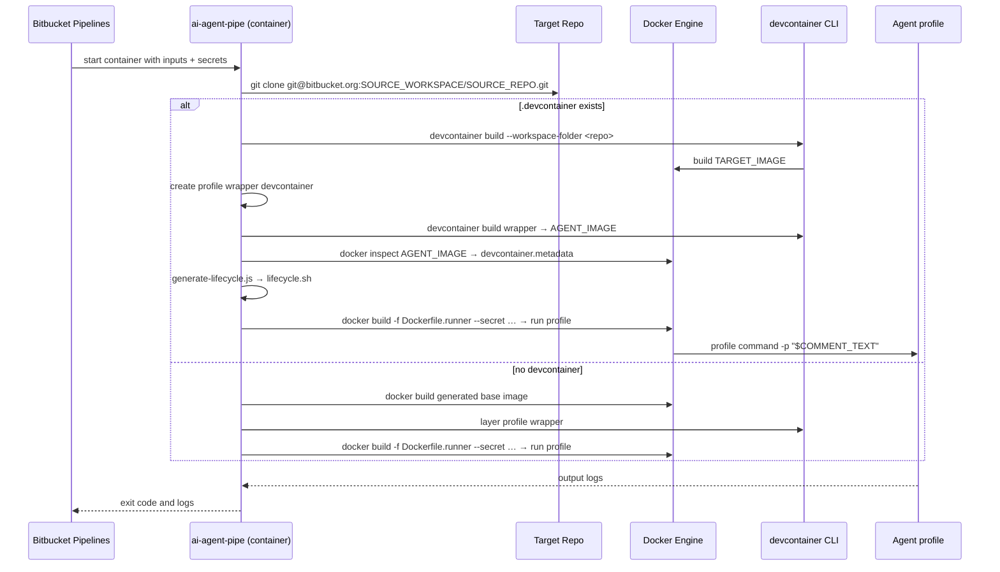

# ai-agent-pipe

A reusable **[Bitbucket Pipe][bb-pipes]** that clones a target repository,
builds its devcontainer when present, layers an AI agent profile on top,
and executes that agent with BuildKit-mounted secrets.

The shipped profiles are `copilot` and `cursor`. Both install their CLI
through a devcontainer feature, configure bb-mcp, replay devcontainer
lifecycle commands, and run the agent as the devcontainer user. The Cursor
profile uses Cursor's print mode (`cursor-agent -p`) for non-interactive
pipeline execution.

It is designed to be invoked by the
[forge-bitbucket-ai-agent-dispatcher](../README.md) Forge app via the
Bitbucket [on-demand pipelines API][bb-ondemand], so teams do not need to
maintain a separate hub repository or `bitbucket-pipelines.yml`.

The pipe image is published to GitHub Container Registry on every push to
`main` and on every GitHub Release – see
[`../.github/workflows/publish-pipe.yml`](../.github/workflows/publish-pipe.yml).

```
ghcr.io/fabianschurig/forge-bitbucket-ai-agent-dispatcher/ai-agent-pipe:<tag>
```

---

## Architecture



### Two-image rationale

| Image | Built when | Contains | Purpose |
|------|------------|----------|---------|
| **A – runtime** | once, by CI, published to GHCR | `git`, `docker` CLI, `node`, `@devcontainers/cli`, scripts | Orchestration only – kept small |
| **B – agent** | dynamically at runtime, inside the Pipe | Target devcontainer or generated base + selected agent profile + lifecycle replay | Execution; secrets mounted at `docker build` time and never persisted |

---

## Inputs

| Variable | Required | Description |
|---|:--:|---|
| `AGENT_TYPE` |  | Agent profile to run. Defaults to `copilot`; supported values are `copilot` and `cursor`. |
| `SOURCE_WORKSPACE` | ✅ | Bitbucket workspace slug of the spoke repository. |
| `SOURCE_REPO` | ✅ | Repository slug of the spoke repository. |
| `SOURCE_BRANCH` | ✅ | Branch of the spoke repository to check out. |
| `COMMENT_TEXT` | ✅ | Raw text of the triggering PR comment – used as the Copilot prompt. |
| `PR_ID` |  | Pull-request numeric ID (audit only). |
| `COMMENT_AUTHOR` |  | Atlassian account ID of the comment author (audit only). |
| `COPILOT_GITHUB_TOKEN` | ✅ 🔒 when `AGENT_TYPE=copilot` | GitHub Copilot token used by the Copilot profile. `COPILOT_TOKEN` is accepted as a legacy alias. |
| `CURSOR_API_KEY` | ✅ 🔒 when `AGENT_TYPE=cursor` | Cursor API key used by the Cursor profile. |
| `BITBUCKET_TOKEN` | ✅ 🔒 | Bitbucket API token used by bb-mcp. With `BITBUCKET_USERNAME` it uses username/token auth; without a username it uses Bearer auth. `BB_TOKEN` is accepted as a legacy alias. |
| `BITBUCKET_USERNAME` | 🔒 | Optional Bitbucket username used with `BITBUCKET_TOKEN` for username/token auth. Omit it to use Bearer auth. `BB_USERNAME` is accepted as a legacy alias. |
| `SSH_KEY` | ✅ 🔒 | SSH private key used to clone the spoke repository. |

> 🔒 = **must** be configured as a *Secured* Bitbucket repository variable
> so it is masked in build logs and only ever materialised on tmpfs at
> runtime. Tokens are never baked into the published image.

The non-secret variable names (`SOURCE_WORKSPACE`, `SOURCE_REPO`, etc.)
match what the Forge dispatcher emits as pipeline variables (see
[`src/ondemandPipelinePayload.ts`](../src/ondemandPipelinePayload.ts)).
The selected agent secret (`COPILOT_GITHUB_TOKEN` or `CURSOR_API_KEY`),
`BITBUCKET_TOKEN`, `SSH_KEY`, and optionally `BITBUCKET_USERNAME` are **not**
sent by the dispatcher — they must be configured as *Secured* repository or
workspace variables in Bitbucket so they are available at pipeline runtime.

When `BITBUCKET_USERNAME` is configured, bb-mcp receives both username and
token for username/token authentication. When only `BITBUCKET_TOKEN` is
configured, bb-mcp receives the token without a username and uses Bearer
authentication.

---

## Usage

### From the Forge dispatcher

Configure the dispatcher with the `BITBUCKET_ONDEMAND` provider and set
the on-demand YAML to:

```yaml
image: atlassian/default-image:4
pipelines:
  default:
    - step:
        name: Run ai-agent-pipe
        size: 2x
        services: [ docker ]
        script:
          - export DOCKER_BUILDKIT=1
          - pipe: docker://ghcr.io/fabianschurig/forge-bitbucket-ai-agent-dispatcher/ai-agent-pipe:v0.3.0
            variables:
              AGENT_TYPE: copilot
              SOURCE_WORKSPACE: $SOURCE_WORKSPACE
              SOURCE_REPO: $SOURCE_REPO
              SOURCE_BRANCH: $SOURCE_BRANCH
              PR_ID: $PR_ID
              COMMENT_TEXT: $COMMENT_TEXT
              COMMENT_AUTHOR: $COMMENT_AUTHOR
              COPILOT_GITHUB_TOKEN: $COPILOT_GITHUB_TOKEN
              BITBUCKET_TOKEN: $BITBUCKET_TOKEN
              # Optional: set BITBUCKET_USERNAME for username/token auth.
              # Omit it to use BITBUCKET_TOKEN as Bearer auth.
              # BITBUCKET_USERNAME: $BITBUCKET_USERNAME
              SSH_KEY: $SSH_KEY

definitions:
  services:
    docker:
      memory: 4096
```

The dispatcher will substitute the dollar-prefixed values from the
pipeline variables it sends with the API request.

To use Cursor instead, set `AGENT_TYPE: cursor`, replace
`COPILOT_GITHUB_TOKEN` with `CURSOR_API_KEY`, and keep the remaining variables
unchanged:

```yaml
variables:
  AGENT_TYPE: cursor
  CURSOR_API_KEY: $CURSOR_API_KEY
  BITBUCKET_TOKEN: $BITBUCKET_TOKEN
  SSH_KEY: $SSH_KEY
```

### From `bitbucket-pipelines.yml` (manual)

```yaml
pipelines:
  custom:
    run-agent:
      - step:
          name: Run ai-agent-pipe
          size: 2x
          services: [ docker ]
          script:
            - export DOCKER_BUILDKIT=1
            - pipe: docker://ghcr.io/fabianschurig/forge-bitbucket-ai-agent-dispatcher/ai-agent-pipe:latest
              variables:
                AGENT_TYPE: 'copilot'
                SOURCE_WORKSPACE: 'my-workspace'
                SOURCE_REPO: 'my-spoke-repo'
                SOURCE_BRANCH: 'feature/x'
                COMMENT_TEXT: '@agent please fix the failing tests'
                COPILOT_GITHUB_TOKEN: $COPILOT_GITHUB_TOKEN
                BITBUCKET_TOKEN: $BITBUCKET_TOKEN
                # Optional: set BITBUCKET_USERNAME for username/token auth.
                # Omit it to use BITBUCKET_TOKEN as Bearer auth.
                # BITBUCKET_USERNAME: $BITBUCKET_USERNAME
                SSH_KEY: $SSH_KEY

definitions:
  services:
    docker:
      memory: 4096
```

For Cursor, use `AGENT_TYPE: 'cursor'` and provide
`CURSOR_API_KEY: $CURSOR_API_KEY` instead of the Copilot token.

### Local debugging with `docker run`

```bash
docker run --rm \
    -v /var/run/docker.sock:/var/run/docker.sock \
    -e AGENT_TYPE=copilot \
    -e SOURCE_WORKSPACE=my-workspace \
    -e SOURCE_REPO=my-spoke-repo \
    -e SOURCE_BRANCH=main \
    -e COMMENT_TEXT='@agent hello' \
    -e COPILOT_GITHUB_TOKEN \
    -e BITBUCKET_TOKEN \
    -e SSH_KEY="$(cat ~/.ssh/id_ed25519)" \
    ghcr.io/fabianschurig/forge-bitbucket-ai-agent-dispatcher/ai-agent-pipe:latest
```

> The pipe requires a working Docker daemon because the agent image is
> built and executed at runtime. In Bitbucket Pipelines, enable the
> `docker` service, use `size: 2x` for realistic devcontainer builds, and
> allocate at least 4096 MB to the Docker service. Runtime v3 is preferred
> because it supports the BuildKit features this pipe uses.

---

## File layout

```
pipe/
├── Dockerfile                          # runtime image (Image A)
├── entrypoint.sh                       # input mapping + secret materialisation
├── pipe.yml                            # Bitbucket Pipe metadata
├── README.md                           # this file
├── scripts/
│   ├── run-agent.sh                    # clone + devcontainer build + run
│   ├── validate-config.sh              # fail-fast input validation
│   └── generate-lifecycle.js           # replay devcontainer lifecycle commands
└── config/
  └── agents/
    ├── copilot/
    │   ├── agent.env               # command, flags, model, and config paths
    │   ├── copilot-instructions.md # profile instructions copied to ~/.copilot
    │   ├── mcp-config.json         # bb-mcp config template
    │   └── wrapper-devcontainer/   # Copilot CLI devcontainer feature
    └── cursor/
        ├── agent.env               # command, flags, model, and config paths
        ├── cursor-instructions.md  # profile instructions
        ├── mcp-config.json         # Cursor-compatible bb-mcp config template
        └── wrapper-devcontainer/   # Cursor CLI devcontainer feature
```

The Copilot MCP configuration is installed at
`~/.copilot/mcp-config.json`. The Cursor profile uses Cursor's global MCP
configuration path, `~/.cursor/mcp.json`, with the same Bitbucket server and
BuildKit-rendered credentials.

---

## Security

* Secrets are passed in via environment variables, written to **tmpfs only**
  (`/tmp/ai-agent-pipe.secrets`, mode `0600`), and mounted into the runtime
  agent build using BuildKit `--mount=type=secret`. They never appear in
  the final image layers.
* The publish workflow runs with `permissions: { contents: read,
  packages: write }` – the minimum needed to push to GHCR.
* `entrypoint.sh` never echoes secret values; only variable *names* are
  passed to `validate-config.sh`.
* `entrypoint.sh` embeds Bitbucket's published host keys in
  `known_hosts` at build time (no runtime `ssh-keyscan`) so the clone
  is MITM-protected without disabling `StrictHostKeyChecking`.

[bb-pipes]: https://support.atlassian.com/bitbucket-cloud/docs/use-bitbucket-pipes/
[bb-ondemand]: https://developer.atlassian.com/cloud/bitbucket/rest/api-group-pipelines/
